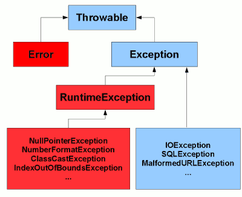
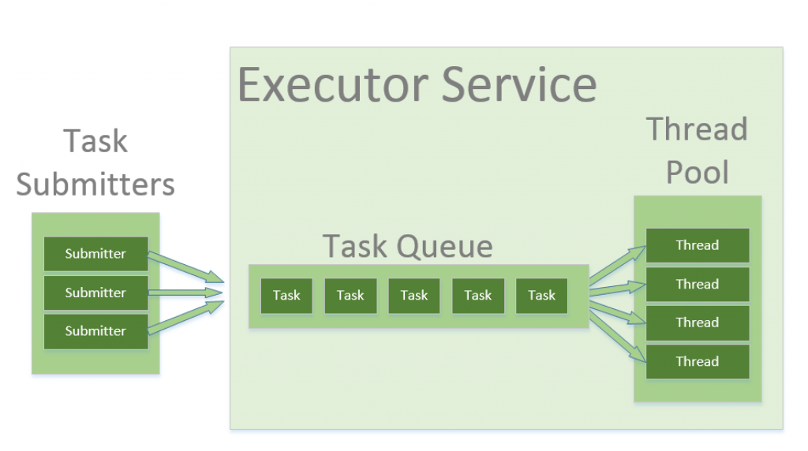

# Week 3 Report

## Exception
  
#### Checked Exception
checked exception được kế thừa trực tiếp từ lớp Exception  
- checked exception được IDE kiểm tra từ giao đoạn compile và tung ra exception nếu có   

#### Unchecked Exception
unchekced exception được kế thừa từ RuntimeException  
- unchecked exception chỉ được tung ra trong giai đoạn run time  
## Concurrency

Nội dung báo cáo phần 2 
https://www.canva.com/design/DAFpQgyQr4M/ynR8VT4YGKbtwc1MHxMyzw/edit?utm_content=DAFpQgyQr4M&utm_campaign=designshare&utm_medium=link2&utm_source=sharebutton
#### Runnable

#### Threadpool

#### Others

## Json
Thêm các dependency vào pom.xml 
jackson-core và gson  
gson.toGson() để ghi object ra file json  
JsonParser để đọc object từ file vào  

