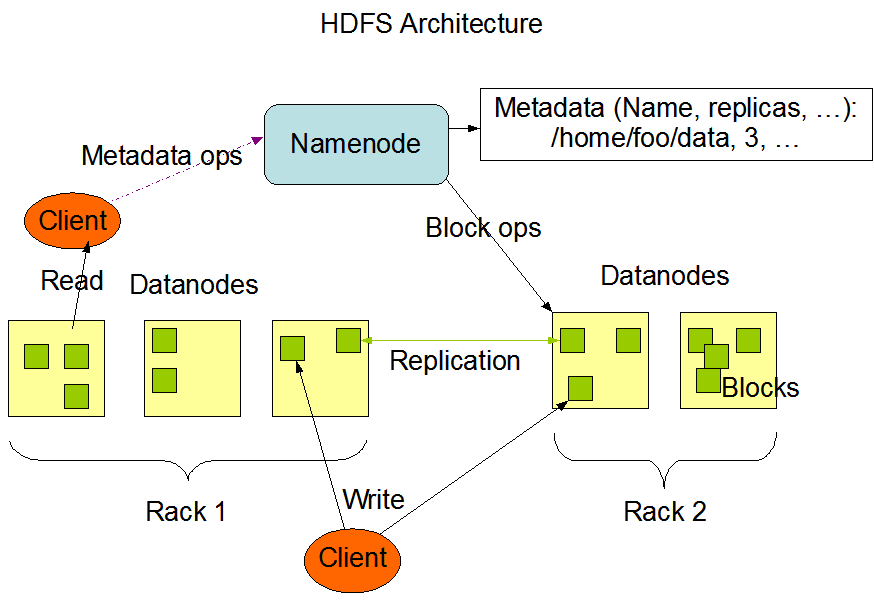
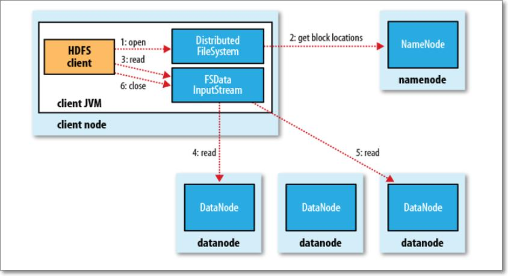
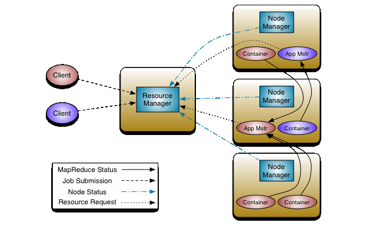
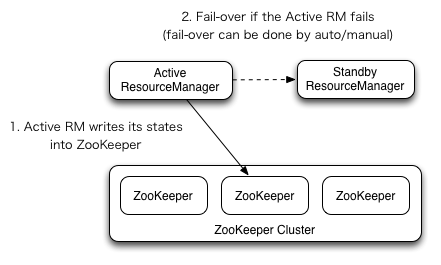
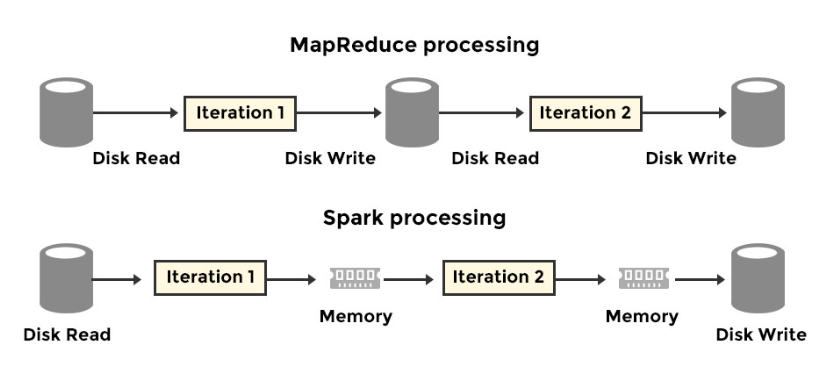

# Week 5 - 6
## Phần 1: Big data và Hadoop ecosystem
### 1. Dữ liệu lớn
- Big Data (dữ liệu lớn) là thuật ngữ dùng để mô tả khối lượng lớn và phức tạp của dữ liệu mà các công cụ truyền thống xử lý và quản lý dữ liệu không thể đáp ứng được. Điều đặc biệt về Big Data là nó không chỉ dựa vào kích thước của dữ liệu mà còn bao gồm tính đa dạng, tốc độ sinh ra và sự phức tạp của dữ liệu.
- Big Data có 3 tính chất chính.
- Volume (khối lượng): Dữ liệu được thu thập từ nhiều thiết bị khác nhau như điện thoại, máy tính, thiết bị iot ...
Tạo lên một khối lượng dữ liệu khổng lồ.
- Variety (đa dạng): Nhiều nguồn dữ liệu được thu thập, cùng với đó là nhiều dạng dữ liệu, dữ liệu
có thể ở dạng có cấu trúc (structured data), không có cấu trúc (unstructured data) hoặc một nửa (semi-structured data).
- Velocity (tốc độ): Dữ liệu được sinh ra rất nhanh.
- Ngoài ra còn cái tính chất khác như Veracity (tính chính xác), Value (giá trị), Visualization ...
### 2. Hadoop ecosystem
- Hệ sinh thái Hadoop là nền tảng để hỗ trợ xử lý những vấn đề của dữ liệu lớn.
- Hadoop có 4 thành phần chính.
- HDFS (Hadoop distributed file system): phụ trách cho việc lưu trữ dữ liệu trên nhiều node khác nhau. Thành phần chính của nó là Namenode và Datanode.
Namenode lữu trữ metadata về những data được lưu trữ ở Datanode, Datanode là nơi dữ liệu thực sự được lưu trữ.
- Yarn (Yet another resource negotiator): hỗ trợ quản lý tài nguyên trên các cụm, nó lập lịch trình cho các job được gửi từ client và phần bố tài nguyên cho các node trong cụm để thực hiện job đó. Hai thành phần chính của nó là Resource manager và Node manager.
- MapReduce: là một hadoop framework, bằng cách sử dụng các thuật toán phân tán và song song, MapReduce cho phép thực hiện logic của quá trình xử lý và giúp viết các ứng dụng chuyển đổi các tập dữ liệu lớn thành một tập hợp có thể quản lý được.

## Phần 2: hdfs block, block replication
### 1. hdfs block
- Một file khi được lưu trữở hdfs, nó được chia ra theo các hdfs block, mỗi hdfs block được tạo thành từ nhiều filesystem block, và mỗi filesystem block lại là tổng hợp của nhiều disk block.
- Việc tổng quát hóa (trừu tượng hóa) như vậy có nhiều lời ích. Một file có thể lớn hơn toàn bộ dung lượng của ô đĩa của một máy trong cụm, hoặc một file nhỏ hơn nhiều so với size của hdfs block thì cũng chỉ chiếm size như vậy trong ổ đĩa (không phải size của hdfs block).
- hdfs block là một đơn vị bộ nhớ mà Namenode tham chiếu đến.
- Việc để cho size của hdfs lớn giúp cho số lượng hdfs block mà Namenode phải quản lý giảm bớt. Ngoài ra nó tận dụng thời gian chuyển file so với thời gian tìm block của ổ đĩa, block size lớn cũng giúp tăng hiệu suất Mapreduce.
### 2. Block replication
- Việc sao chép các block từ data node này sang data node khác giúp tăng tính khả dụng của hệ thống.
- Việc chọn node để sao chép có nhiều cách, replica đầu tiên có thể tại chính node của client, nếu client bên ngoài cụm thì replica đặt random.
Replica thứ hai đặt khác với node đầu nhưng cùng rack, tiếp tục như vậy ...
## Phần 3: Khái niệm cơ bản về hdfs, yarn, spark
### 1. HDFS
- hdfs là hệ thống tập tin phân tán được thiết kế để sử dụng cho phần cứng thương mại. Nó khác với các hệ thống file thông thường.
Nó có tính chịu lỗi cao và triển khai trên được những phần cứng rẻ tiền. Nó cho phép truy cập dữ liệu với thông lượng lớn. 
- Tính chất của hdfs: xử lý lỗi phần cứng, truy cập dữ liệu dạng streaming, lưu trữ dữ liệu lớn, linh động với nhiều loại phần cứng và các phần mềm.
- Giới hạn: Hdfs cung cấp truy cập theo batch (offline) hơn là truy cập theo streaming (online).
và giới hạn số lượng file lưu tại metadata trên namenode bị giới hạn bới bộ nhớ tại namenode đó.
#### 1.1 Thành phần của HDFS
- Kiến trúc của HDFS là master/slave.
- Một cụm hdfs bao gồm 1 namenode, chứa metadata về các dữ liệu được lưu trữ ở các node trong cụm.
nó quản lý không gian tên file và quy định truy cập của client. 
- Trong một cụm hdfs có nhiều node và thường mỗi node có 1 datanode, datanode phục vụ việc đọc, ghi từ client ...
- Kiến trúc của HDFS

#### 1.2  Namenode
- Namenode duy trì metadata cho các tất cả các file trong cụm, và chúng được lưu trong ổ đĩa local tại namenode đó.
- Thành phần của namenode có: Namespace Image file (FS image), Edit log
- Namespace Image file (FS image): là file thể hiện trạng thái của của hệ thông file sau khi có sửa đổi.
Mỗi lần sửa đổi, fs image sẽ có 1 transaction ID mới (monotonic increase).
- Edit log: là file chứa các bản ghi thể hiện tất cả những sự thay đổi đã diễn ra từ lần cập nhật gần nhất của fs image.
- Cách Namenode hoạt động: Khi khởi chạy namenode, đầu tiên nó sẽ tạo ánh xạ chứa vị trí của data block của tất cả các file từ block report được gửi
định, namenode tính toán và lưu nó ở bộ nhớ. Ngoài ra, trong giai đoạn khởi chạy nó cũng dùng fs image sử dụng edit log để lấy được trang thái mới nhất của metadata của hệ thống file.
nó cập nhật trạng thái mới nhất vào fs image và tiếp tục hoạt động vơi edit log (rỗng, vì đã sử dụng từ đầu rồi). 
- Vấn đề xảy ra khi edit log rất lớn, nó làm thời gian khởi chạy namenode lâu => Secondary Namenode.
- Secondary Namenode: nó không phải backup của primary namenode, nó dùng để merge fs image và edit log định kỳ 
- Vấn đề về single-point-of-failure => back up metadata, secondary namenode, standby namenode.
#### 1.3 Datanode
- Datanode: là nơi thật sự lưu trữ dữ liệu trong hệ thông file của nó, và nó cũng thường xuyên gửi block report về cho namenode.
#### 1.4 Quá trình đọc-ghi trong hdfs
#### 1.4.1 Quá trình ghi
- Việc ghi được khời tạo bởi client, có thể dùng Java API hoặc hdfs command line.
- Đầu tiên client lưu trữ file tại ổ đĩa local của nó.
- Client gửi request đến Namenode, yêu cầu ghi file, Namenode kiểm tra tên file, permission của client và trả lại metadata tương ứng.
- Client nhận được thông tin danh sách các Datanode trong metadata, nó bắt đầu chia file ra theo các block và bắt đầu gửi cho Datanode đầu tiên.
- Datanode nhận được từng block, lưu trữ lại local disk và bắt đầu chuyển sang cho các Datanode trong danh sách mà Namenode chỉ định cho client.

Mô hình mô trả quá trình viết.
#### 1.4.2 Quá trình đọc
- Việc đọc cũng gần nhu tương tự, client bắt đầu gửi request cho Namenode về yêu cầu đọc một file.
- Namenode trả về cho client metadata mô tả địa chỉ của một số lượng Datanode định sẵn. Danh sách này ưu tiên sắp xếp theo khoảng cách đến client.
Nếu client đó chính là 1 Datanode mà nó cũng chứa block cần đọc thì nó sẽ đọc tại local luôn.
- Nếu không, client sẽ connect đến Datanode gần nhất theo danh sách được trả về từ Namenode và data được truyền đến client cho đến hết block.
- Quá trình tiếp tục, cho đến hết 1 batch => batch tiếp theo, client lại nhận danh sách từ Namenode ...
- Việc đọc theo nhiều batch là hoàn toàn trong suốt đối với client, nếu có lỗi xảy ra trong việc connect đến Datanode, client sẽ chuyển đến Datanode khác theo thứ tự khoảng cách, max checksum cũng được sử dụng để kiểm tra lỗi truyền tải.

Mô hình miêu tả quá trình đọc.
#### 1.5 High availability in hdfs
Tính khả dụng là một tính chất quan trọng trong hệ thống phân tán, nó thể hiện mức độ hoạt động liên tục của một hệ thống trong một khoảng thời gian dài nhất định.
Trong một hệ thống như vậy, một Namenode là không đủ, để đề phòng Namenode bị lỗi, cần thêm các Standby Namenode hỗ trợ.
Để trong trường hợp 1 Namenode sập hoặc cần bảo trì, update thì sẽ có Namenode khác thay (Standby Namenode).  

- Trong cài đặt thực tế, mỗi cụm có một Namenode (active) những Namenode còn lại ở trạng thái Standby, nó lữu giữ trạng thái thay đổi của active Namenode.
- Để một Standby Namenode đồng bộ trạng thái với Active Namenode, cả đều giao tiếp thông qua các JournalNode.
- Với sự thay đổi của Namenode sẽ được ghi vào phần lớn các Journalnode, standby Namenode đọc từ đó để đồng bộ.
- Các Datanode thì được cấu hình để gửi block location cho tất cả Namenode (cả active va standby).
- Và để đảm bảo không gian tên file luôn đúng và đồng bộ, chỉ cho Journalnode chỉ cho phép 1 Namenode có quyền ghi vào 1 thời điểm.
- Số lượng Journalnode nên là số lẻ, số lượng lỗi các JN tối đa chịu được là (N-1)/2.
- Fencing: Đảm bảo 1 active Namenode khi đã bị thay thế không phục vụ thao tác đọc cho client.

Một các khác để đat được HA là sử dụng NFS (Network file system)
- Edit log được chia sẽ giữa những Namenode bằng 1 NFS directory chung. 
- Vì đ tránh single-point-of-failure => nhiều NFS chung => nên sử dụng NAS xịn thay vì 1 Linux server bình thường.
### 2. Yarn, MapReduce
Yarn (Yet another resource negotiator) có thể được coi như OS của 1 cụm. Nó quản lý tài nguyên của cụm, lập lịch và giám sát các job.
Nó thực hiện điều này với 2 deamons, đó là Resource manager và Node manager.
Kiến trúc của nó là master-slave, với resource manage là master và mỗi máy tính trong cụm có một node manager.
  
Sơ đồ mô tả kiến trúc của Yarn.
#### 2.1 Resource manager
- Resource manage có 2 thành phần chính, đó là scheduler và application manager.
- Scheduler có trách nhiệm phân bố tài nguyên đến các chương trình đang chạy với những ràng buộc về dung lượng, ... nó không giám sát hay khắc phục khi lỗi xảy ra.
- Application manager có trách nhiệm nhận job-submission, start container (mem, cpu, ...) cho Application master, và nó cũng restart application master container khi contain fail. 
- Việc chỉ có một Resource manager cho mỗi cụm cũng nảy sinh ra vấn đề (single point of failure) => standby resource manager.
Việc chuyển đổi từ standby sang active có thể là theo chủ ý hoặc tự động (Zookeeper)

  
Sơ đồ Resource manager HA.
#### 2.2 Node manager
- Node manager có trách nhiệm khởi tạo và quản lý container trên 1 node. Container thực thi các nhiệm vụ được chỉ định bởi Application master.
#### 2.3 The workflow
#### 2.4 Scheduling in Yarn
##### 2.4.1 FIFO scheduler
First in fisrt out scheduler, các job gửi từ client được cho vào hàng đợi và được thực thi theo thứu tự đưa vào.
Nhưng vấn đề là các job không có mức độ ưu tiên, nên job vào sau mà quan trọng hơn vẫn phải đợi.
#### 2.4.2 Capacity scheduler
Capacity scheduler đưược sử dụng để hỗ trợ cho những ứng dụng sử dụng shared cluster, nhiều bên cùng sử dụng cluster, từ đó tối ưu được thông lượng và tính sử dụng của cluster.
Sử dụng capacity scheduler giúp cải thiện giá thành, và trong lúc các tổ chức khác không sử dụng, thì có thể dùng capacity của họ (elasticity).
#### 2.4.3 Fair scheduler
Tài nguyên được chia đều giữa các queue, và các chia đều giữa các job trong từng queue.

#### 2.5 MapReduce
- MapReduce là một software framework để viết những chương trình xử lý lượng dữ liệu lớn một cách song song trên các cụm lớn có độ tin cậy và chịu lỗi cao.
- Tính chất của MapReduce: phân tán, song song, chịu lỗi, mở rộng.
- Input và Output: làm việc với dữ liệu dạng key-value pairs, và dữ liệu phải đáp ứng serializable, comparable. Serializable cho việc truyền tải dữ liệu, comparable cho việc sắp xếp ở reduce phase.
- Map phase: chuyển đổi dữ liệu sang dạng trung gian.
- Reduce phase: được group lại thành một tập nhỏ hơn từ tập key trung gian.
### 3. Spark
Spark là một platform để xử lý dữ liệu thay thế cho MapReduce.
Spark làm tốt hơn MapReduce ở một vài yếu tố.
- Interative job: job có tính lặp lại, MapReduce đọc dữ liệu từ disk và ghi vào disk và job tiếp theo lại tiếp tục như vậy, việc đọc ghi từ disk chậm hơn nhiều so với từ Memory (RAM).
- Spark có đa dạng API hơn MapReduce. 
  
- Ngoài ra Spark vẫn giữ lại những điểm mạnh của MapReduce, như tính chịu lỗi, cân bằng tải ...
#### 3.1 Spark architecture
- Spark cũng có kiến trúc master/slave giống như MapReduce, tiến trình master là Drive, còn slave là Executor.
- Driver là tiến trình quản lý việc thực thi các job của Spark, phân bố và lập lịch cho cho các job đến các Executor.
- Executor là tiến trình thợ, nó thực thi những chương trình được gửi đến từ Driver và báo cáo trạng thái cộng việc lại cho Driver.
#### 3.2 Execution mode
- Spark có thể thực thi với 2 chế độ.
- Cluster mode: user gửi spark job đến cluster manager (có thể là yarn), cluster manager tạo driver và executors để thực thi job. Cả tiến trình driver và executor đều nằm trong cụm.
- Client mode: điểm khác biệt so với cluster mode là tiền trình driver nằm ở máy client chứ không nằm trong cụm.
#### 3.3 Spark application life cycle
- User submit spark job đến cụm, với lệnh spark-submit, tiến trình ở client connect được với resource manager deamon, nều job được chấp nhận thì RM sẽ tạo tiến trình driver trên 1 máy nào đó trong cụm.
- Một khi tiến trình driver chạy, nó khởi tạo Spark session, nó dùng đẻ tương tác vơi RM để tạo các executor trên các worker node trong cụm.
- RM tạo các tiến trình executor trên các máy trong cụm và trả về địa chỉ của nó cho driver. Cụm Spark được hình thành và driver có thể tương tác với executor.
- Cụm Spark đã sẵn sàng, driver gửi các code cho executor để chạy, executor báo cáo trạng thái công việc cho driver.
- Tiến trình driver kết thúc khi xong việc, cluster manager tắt các executor, và nó có thể được query để biết job chạy thành công hay không.
#### 3.4 Spark API
- Trừu tượng hóa dự liệu với RDD (Resilient Distributed Dataset)
- DataFrames
- Datasets
#### 3.5 Action and Transformation
- Transformation là hoạt động của Spark API mà nó thực hiện biến đổi, lọc ... và trả về Spark data abstraction như RDD hay DataFrame. (chỉ để xây dựng Execution plan để action thực hiện)
- Action là hoạt động mà Spark API thực hiện thực sự trên data abstraction đó và nó trả về object bình thường.