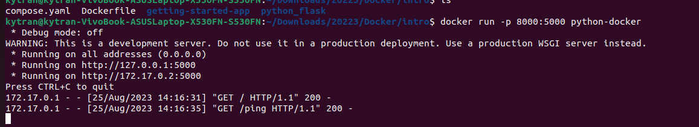

### 1. Các vấn đề còn lại từ tuần 7
- Giải thích block report và heart. 
Block report và heart beat là tín hiệu gửi tù datanode đến namenode, heart beat để namenode biết được datanode còn sống, block report để báo cáo danh sách các block mà datanode đó đã lưu.  
  https://hadoop.apache.org/docs/stable/hadoop-project-dist/hadoop-hdfs/HdfsDesign.html#NameNode_and_DataNodes
- Giải thích ảnh hưởng của block size đến mapreduce. 
Số lượng mapper bằng với số lượng split, theo mặc định block size bằng với split size, nên khi block size quá nhỏ dẫn đến file được chia thành nhiều split và sẽ có nhiều mapper xử lý, chi phí overhead cao.
Ngược lại nếu block size quá lớn cũng làm chậm mapper vì phải xử lý nhiều dữ liệu.  
  https://data-flair.training/blogs/mapreduce-inputsplit-vs-block-hadoop/
- Rack là gì ? 
Rack là tập hợp các máy tính chạy datanode trong cụm hadoop ở cùng 1 địa điểm vật lý, các datanode trong cùng một rack sử dụng chung 1 switch nên truy cập giữa datanode trong rack sẽ nhanh hơn ngoài rack.  
  https://www.geeksforgeeks.org/hadoop-rack-and-rack-awareness/
- Với block size là 128MB, có cần thiết dữ liệu phải đủ 128MB để được lưu xuống hdfs hay không, và nếu có thì tính chịu lỗi thể hiện ở chỗ nào?  
Dữ liệu không cần phải đủ 128MB mới được ghi xuống hdfs, hdfs block chỉ là khái niệm trừu tượng, với một hdfs block 64MB nó được lưu ở local fs với các disk block nhỏ hơn nhiều.
Việc để hdfs block lớn hơn nhiều so với disk block để giảm thời gian tìm kiếm (vì các disk block được lưu trữ liên tục với nhau trong bộ nhớ).  
  https://www.educative.io/courses/introduction-to-big-data-and-hadoop/disk-blocks-hdfs-blocks
- Quá trình ghi trong hdfs được coi là thành công khi nào?  
Quá trình ghi trong hdfs được coi như thành công khi các datanode đã tiền hành replication xong.  
  https://www.educative.io/courses/introduction-to-big-data-and-hadoop/disk-blocks-hdfs-blocks
- Trong mapreduce, việc shuffle sau khi, dữ liệu sẽ được sẽ được tập hợp lại vào các partition theo key ?  
Dữ liệu được hash vào cùng partition theo key, có thể là tập hợp các key. 
  https://data-flair.training/blogs/shuffling-and-sorting-in-hadoop/
- Cơ chế khởi động lại RM, bảo vệ và không bảo vệ.  
Cơ chế bảo vệ (work-preserving): RM khi khởi động lại không cần chạy lại application như ở non-preserving, application có thể đồng bộ và chạy tiếp tục chạy. 
Cơ chế không bảo vệ (non-work-preserving): RM lưu metadata của application trong một kho lưu trữ trạng thái và RM cũng lưu trạng thái hoàn thành của application (failed, killed, finished), RM cũng lưu thông tin xác thực.
Khi RM tắt, những thông tin này được lưu ở kho lưu trữ trạng thái rồi thì có thể được dùng lại khi RM khởi động lại và application được gửi lại nếu như nó chưa hoàn thành trước khi RM tắt. 
  https://hadoop.apache.org/docs/stable/hadoop-yarn/hadoop-yarn-site/ResourceManagerRestart.html
- Cơ chế đồng bộ của Active và StandBy Resource Manager là như thế nào ?  
??  
- So sánh ưu nhược điểm của Cluster và Client mode của Spark.  
Cluster mode: client submit spark application đến cluster manager (YARN), yarn tạo driver và executor đều nằm trong cụm. 
client có thể làm việc khác trong khi đợi kết quả của spark. 
Client mode: tiến trình driver nằm trên máy client, phù hợp với debug vì có thể thấy log trong terminal, tương tác ...
  https://spark.apache.org/docs/latest/running-on-yarn.html#:~:text=In%20cluster%20mode%2C%20the%20Spark,for%20requesting%20resources%20from%20YARN.  
  https://medium.com/@sephinreji98/understanding-spark-cluster-modes-client-vs-cluster-vs-local-d3c41ea96073  
- Các phép tính chỉ thực hiện trên Dataset.  
Có thể convert từ RDD, DataFrame sang Dataset, tái tạo RDD từ Dataset (DataFrame ko làm được).  
  https://data-flair.training/blogs/apache-spark-rdd-vs-dataframe-vs-dataset/  
### 2. Shell linux
#### 2.1 Command cơ bản thao tác với file và directory
- cd : chuyển thư mục
- ls: liệt kê
- cp: copy
- mv: move
- mkdir: tạo thư mục mới
- rmdir: xóa thư mục rỗng
- cat: đọc file
#### 2.2 Command liên quan đến account và permission
- chmod: thay đổi quyền truy cập trên file
- chown: đổi quyền sở hữu cho file hoặc thư mục
#### 2.3 Lệnh đường ống
- | đầu vào ra của lệnh trước sẽ là đầu vào của lệnh sau
- cat test.txt | grep "a" : tìm kí tự a trong test.txt
- echo "abc" > test.txt : ghi đè abc vào file test.txt
- echo "abc" >> test.txt : ghi lối vào cuối test.txt
#### 2.4 Process command ...
- ps, ps aux: show các process sở hữu bởi user và process đang chạy
- kill: gửi singnal đến 1 process, signal 9 là kết thúc process 
- top, htop: show các tiến trình và tài nguyên nó sử dụng (htop cho phép dùng chuột để tương tác)

### 3. Docker vơi python flask
#### 3.1 Tìm hiểu Docker
- Dockerfile là file chứa các câu lệnh hướng dẫn để build lên một container image.  
- Image cung cấp một môi trường đọc lập cho container. Có thể coi image như một class và container là 1 instance của class đó (theo ngôn ngữ OOP).  
- Container là một tiến trình chạy độc lập trên máy chủ, tách biệt với các tiến trình khác.  
- Dữ liệu của các ứng dụng chạy trong docker được có thể được lưu bền vững với volume.  
Taọ mới 1 volume bằng lệnh  
`docker volume create abc`
Mount volume đến một điểm nào đó trong container vơi option 
`--mount type=volume,src=abc,target=/etc/todos`  
Kiểm tra nơi lưu dữ liệu của volume trên máy host  
`docker volume inspect abc`  
- Kiểm soát mount point tốt hơn vơi bind mount.  
`docker run -it --mount type=bind,src="$(pwd)",target=/src ubuntu bash`  
src là nguồn mount (host), target là mountpoint trong container.  
 

- Multi-container application: để các container nói chuyện được với nhau, cần có chung một network.  
Lệnh tạo docker network.  
`docker network create todo-app`  
Ví dụ chạy container mysql  
`docker run -d \
  --network todo-app --network-alias mysql \
  -v todo-mysql-data:/var/lib/mysql \
  -e MYSQL_ROOT_PASSWORD=secret \
  -e MYSQL_DATABASE=todos \
  mysql:8.0`
--network-alias mysql để chỉ ra tên địa chỉ của container mysql trong network todo-app.  
Ví dụ chạy nodejs connect đến container mysql.  
`docker run -dp 127.0.0.1:3000:3000 \
  -w /app -v "$(pwd):/app" \
  --network todo-app \
  -e MYSQL_HOST=mysql \
  -e MYSQL_USER=root \
  -e MYSQL_PASSWORD=secret \
  -e MYSQL_DB=todos \
  node:18-alpine \
  sh -c "yarn install && yarn run dev"`
--network todo-app chỉ ra container này connect đên network todo-app trond đó container mysql với hostname là mysql.  
- Có thể dùng `docker exec -it [container - id] bash` để vào container và đăng nhập vào mysql để kiểm tra.  

- Docker compose: giúp quản lý và chia sẻ các ứng dụng với multi-container. Tạo file YAML để định nghĩa application stack của cả project.  
  
Ghép cả 2 containers trước đó vào 1 compose.yaml file.
Không cần tạo và chỉ ra một network chung khi khởi chạy từng container nữa, docker compose tự động tạo network chung cho các service trong nó.  
Chạy `docker compose up` để khởi chạy các service, `docker compose down` để tắt các containers và network chung cũng tắt. (không bỏ volume)  

#### 3.2 Thưc hành docker với flask API (python)
Chạy docker container với public port là 8000 ở máy host và map đến port 5000 trong docker. 

Curl gửi get request đến localhost port 8000
