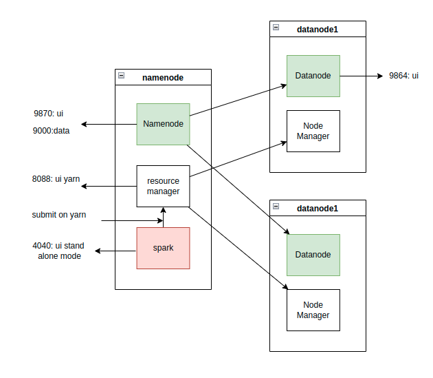
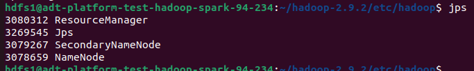
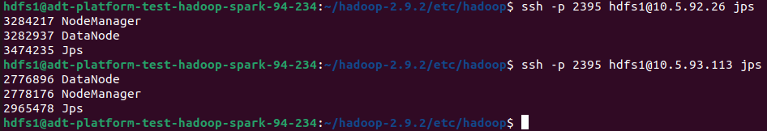
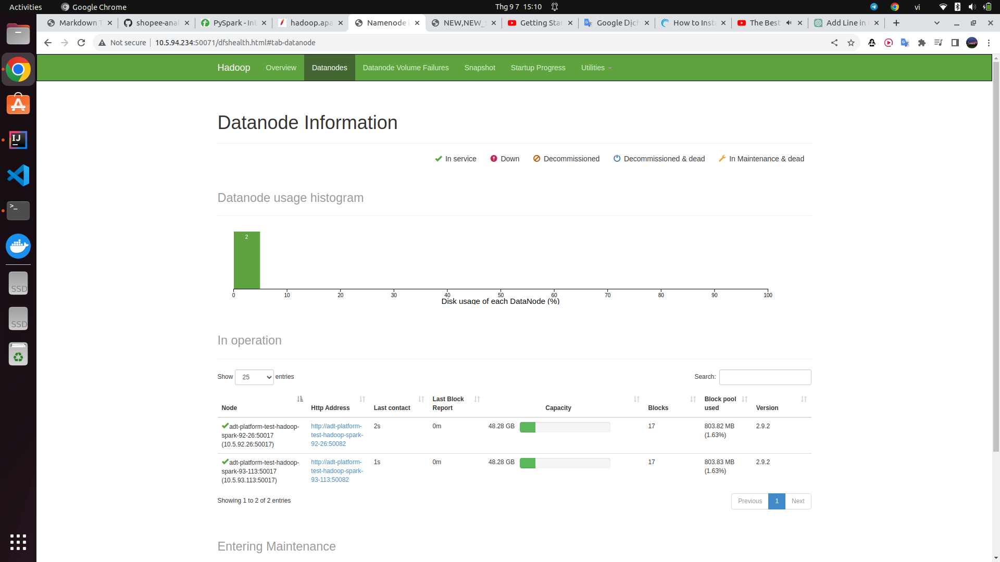
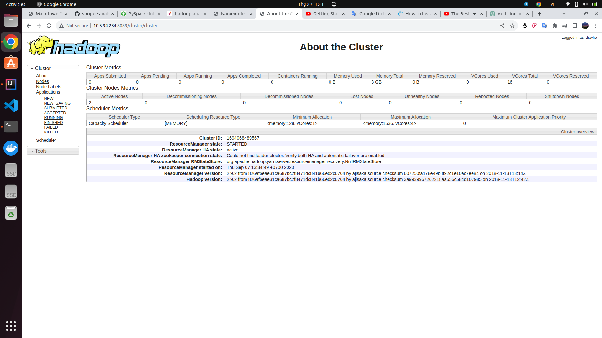
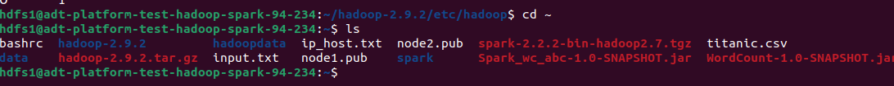
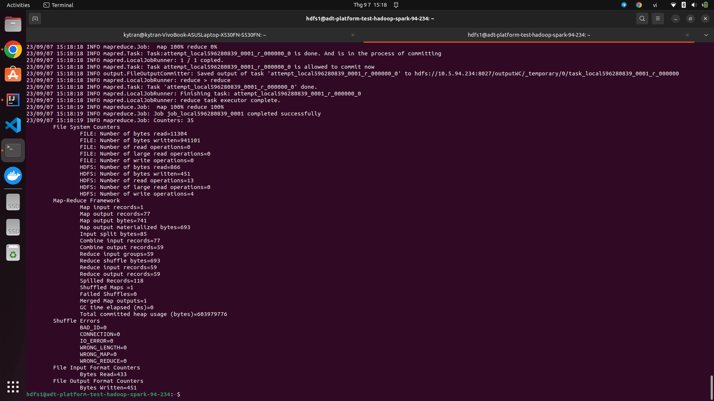
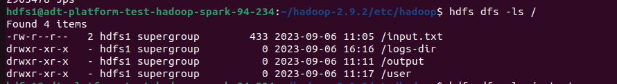
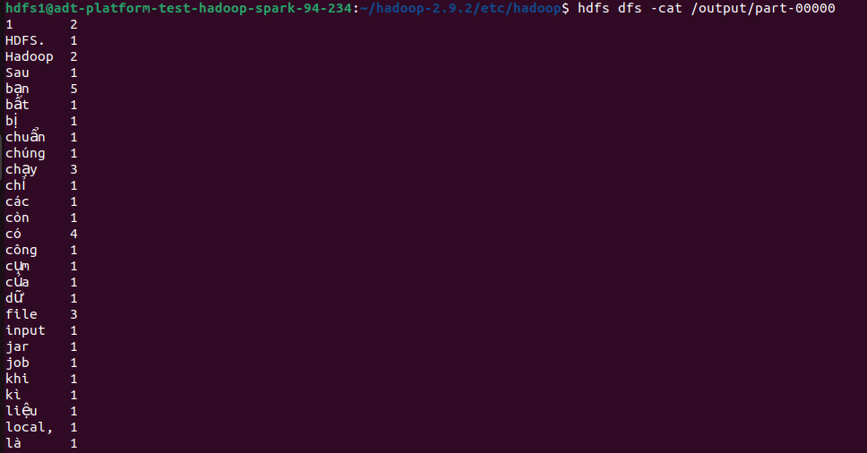

## Phần 1. HDFS, YARN và MAPREDUCE
### 1. Set up môi trường cài đặt cụm HDFS, YARN <br>
Mục tiêu.
 <br>
#### 1.1 Điều kiện trước khi cài đặt <br>
- Có 3 máy, với 1 máy là node-master (namenode, resource manager), 2 máy chạy datanode (datanode và node manager). <br>
- Ở đây là 3 máy với ip tương úng là 10.5.94.234 (master), 10.5.92.26 (node1), 10.5.93.113 (node2) và đều đã cài java.
- Nếu có quyền sudo, sửa file /etc/hosts với ip và tên tương ứng như trên (10.5.94.234 master ...).
- Node master dùng ssh để kết nối với các datanode, nên ta cần lưu public key của node master trên các datanode.
- Lệnh tạo key-pair `ssh-keygen` (chạy trên node master, lưu ý ko nhập passphrase).
- Đọc nội dung public key trong file id_rsa.pub `cat ~/.ssh/id_rsa.pub` 
- Copy nội dung file vừa đọc vào 1 file trung gian trên datanode (master.pub) và append nội dung đó vào file authorized_keys `cat master.pub >> ~/.ssh/authorized_keys` 
- Thực hiện append như vậy cho datanode còn lại.
- Tải hadoop `wget <link to hadoop version.tar.gz>`
- Extract zip file `tar -xzf hadoop-2.9.2.tar.gz`
- Thêm cấu hình vào `.bashrc` file <br>
- ``` 
  export JAVA_HOME=/usr/lib/jvm/java-8-openjdk-amd64
  export HADOOP_HOME=/home/hdfs1/hadoop-2.9.2
  export HADOOP_INSTALL=$HADOOP_HOME
  export HADOOP_MAPRED_HOME=$HADOOP_HOME
  export HADOOP_COMMON_HOME=$HADOOP_HOME
  export HADOOP_HDFS_HOME=$HADOOP_HOME
  export HADOOP_YARN_HOME=$HADOOP_HOME
  export HADOOP_COMMON_LIB_NATIVE_DIR=$HADOOP_HOME/lib/native
  export PATH=$PATH:$HADOOP_HOME/sbin:$HADOOP_HOME/bin
  export HADOOP_OPTS="-Djava.library.path=$HADOOP_HOME/lib/native"
chạy `source ~/.bashrc` để reset thay đổi.
#### 1.2 Cấu hình các môi trường và các file conf của hadoop
- Vào /etc/hadoop trong thư mục hadoop vừa được giải nén
- Thêm dòng export JAVA_HOME `export JAVA_HOME=/usr/lib/jvm/java-8-openjdk-amd64/jre`, tùy vào java version
- Edit core-site.xml <br>
- ```xml
  <configuration>
        <property>
            <name>fs.default.name</name>
            <value>hdfs://node-master:9000</value>
        </property>
  </configuration>
- Edit hdfs-site.xml <br>
- ```xml
  <property>
    <name>dfs.name.dir</name>
    <value>file:///home/hdfs1/hadoopdata/hdfs/namenode</value>
  </property>
  <property>
    <name>dfs.data.dir</name>
    <value>file:///home/hdfs1/hadoopdata/hdfs/datanode</value>
  </property>
  <property>
    <name>dfs.replication</name>
    <value>2</value>
  </property>
tạo folder tương ứng với đường dẫn, `cd ~`, `mkdir hadoopdata/hdfs/namenode`, `mkdir hadoopdata/hdfs/datanode`
- Edit yarn-site.xml
- ```xml
  <property>
       <name>yarn.resourcemanager.hostname</name>
       <value>10.5.94.234</value>
    </property>
    <property>
        <name>yarn.nodemanager.aux-services</name>
        <value>mapreduce_shuffle</value>
    </property>
    <property>
        <name>yarn.nodemanager.aux-services.mapreduce.shuffle.class</name>
        <value>org.apache.hadoop.mapred.ShuffleHandler</value>
    </property>
chưa có cầu hình giới hạn tài nguyên cho các máy nhỏ hơn 8GB RAM.
- Edit mapred_site.xml
- ```xml
  <property>
            <name>mapreduce.framework.name</name>
            <value>yarn</value>
    </property>
    <property>
            <name>yarn.app.mapreduce.am.env</name>
            <value>HADOOP_MAPRED_HOME=$HADOOP_HOME</value>
    </property>
    <property>
            <name>mapreduce.map.env</name>
            <value>HADOOP_MAPRED_HOME=$HADOOP_HOME</value>
    </property>
    <property>
            <name>mapreduce.reduce.env</name>
            <value>HADOOP_MAPRED_HOME=$HADOOP_HOME</value>
    </property> 
- Edit workers và slaves
`10.5.92.26`, `10.5.93.113` thêm 2 địa chỉ này vào 2 file trên.
#### 1.2 Copy cấu hình và chạy thử
- Copy hadoop và extract từ node master sang các datanode
`scp hadoop-*.tar.gz 10.5.92.26:/home/hdfs1/`, `tar -xzf hadoop-*.tar.gz`s
`scp hadoop-*.tar.gz 10.5.9.113:/home/hdfs1/`.
- Copy nội dung các file đã config từ node master sang datanode
`scp $HADOOP_HOME/etc/hadoop/* 10.5.92.26:/home/hdfs1/hadoop-2.9.2/etc/hadoop/` cho cả 2 node.
- Config để ssh qua cổng đã theo ý muốn (mặc định là cổng 22)
`HADOOP_SSH_OPTS="-p 2395"`, thêm dòng này vào cuối hadoop-env.sh và các lệnh ssh, scp phải có options "-P 2395".
- Lưu ý nếu node master không phân giải được datanode name, hoặc vấn đề liên quan đến /etc/hosts
Thêm conf này vào hdfs-site.xml
- ```xml
  <property>
  <name>dfs.namenode.datanode.registration.ip-hostname-check</name>
  <value>false</value>
    </property>
    
    <property>
      <name>dfs.client.use.datanode.hostname</name>
      <value>false</value>
      <description>Whether clients should use datanode hostnames when
        connecting to datanodes.
      </description>
    </property>
    
    <property>
      <name>dfs.datanode.use.datanode.hostname</name>
      <value>false</value>
      <description>Whether datanodes should use datanode hostnames when
        connecting to other datanodes for data transfer.
      </description>
    </property>
- Chạy `hadoop namenode -format`
- `./start-dfs.sh` và `start-yarn.sh` trong `/sbin` của hadoop để khởi chạy các tiến trình tương ứng.
- Kiểm tra với jps trên master và các datanode, bật UI để kiểm tra.
- Kết quả trên node master
 <br>
- Kết quả trên 2 datanode
 <br>
- Kết quả UI

- Yarn

### 2. Chạy chương trình word count với hadoop mapreduce <br>
- Tạo project maven trên IntelliJ, chạy `mvn clean package` để tạo file jar của project.
- Copy jar file lên node master  <br>
- Gửi file input.txt lên hdfs, `hdfs dfs -put input.txt /`
- Submit file jar lên hdfs và chạy word count<br> `hadoop jar WordCount-1.0-SNAPSHOT.jar org.codewitharjun.WC_Runner hdfs://10.5.94.234:8027/input.txt hdfs://10.5.94.234:8027/output`
- Sau khi chạy 
- 
- Kiểm tra output 
- Kết quả

### 3. Sự khác nhau giữa các phiên bản hadoop, spark 2.x và 3.x <br>

## Phần 2. SPARK và PYSPARK <br>
